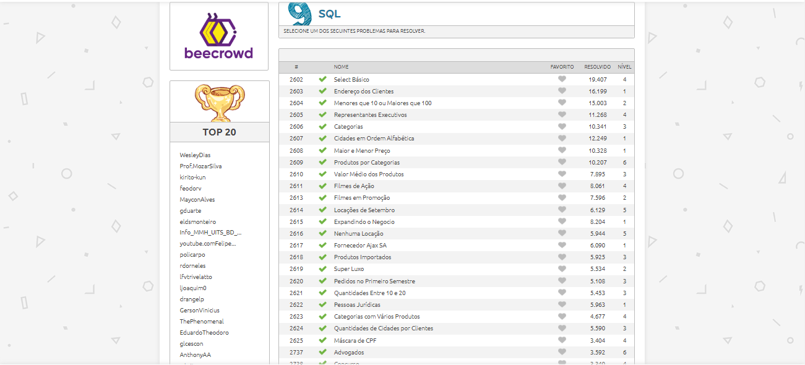

# Beecrowd SQL  

Projeto contendo as respostas dos problemas de SQL do site [Beecrowd](https://www.beecrowd.com.br/judge/pt/problems/index/9).

## Questões respondidas

- [x] 2603
- [x] 2604
- [x] 2605
- [x] 2606
- [x] 2607
- [x] 2608
- [x] 2609
- [x] 2610
- [x] 2611
- [x] 2613
- [x] 2614
- [x] 2615
- [x] 2616
- [x] 2617
- [x] 2618
- [x] 2619
- [x] 2620
- [x] 2621
- [x] 2622
- [x] 2623
- [x] 2624
- [x] 2625
- [x] 2727
- [x] 2738
- [x] 2739
- [x] 2740
- [x] 2741
- [ ] 2742
- [x] 2743
- [x] 2744
- [x] 2745
- [x] 2746
- [ ] 2988
- [ ] 2989
- [x] 2990
- [ ] 2991
- [ ] 2992
- [x] 2993
- [x] 2994
- [ ] 2995
- [ ] 2996
- [ ] 2997
- [ ] 2998
- [ ] 2999
- [ ] 3001
